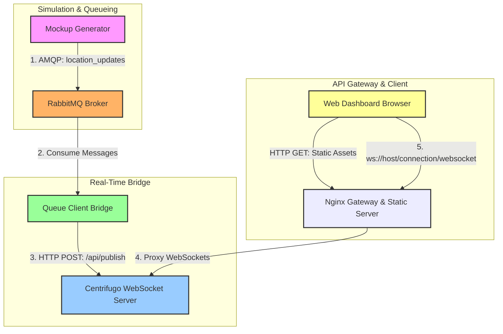

# WSSLab: Real-Time Fleet Tracking System

WSSLab is a demonstration project showcasing a high-performance, real-time vehicle telemetry tracking system. It simulates multiple delivery vehicles driving around key landmarks in Paris and broadcasts their live GPS coordinates, speed, and status to a web-based dashboard using a message queue and WebSocket server.

---

## 1. System Architecture

The project is built as a microservices architecture using Docker containers. The components are decoupled, using RabbitMQ for queueing updates and Centrifugo for broadcasting real-time events.



---

## 2. Component Details

### 1. Mockup Generator (`mockup-generator/`)
* **Role**: Simulates live GPS vehicle telemetry.
* **Technology**: Python 3.11, `pika` library.
* **How it works**:
  * Simulates 3 drivers in Paris: **Alice** (Eiffel Tower), **Bob** (Louvre), and **Charlie** (Arc de Triomphe).
  * Computes updated coordinates every `1.5` seconds using a figure-8 mathematical trajectory (using sine and cosine calculations) to simulate driving behavior.
  * Adds minor random GPS jitter and speed fluctuations (around their base speeds of 35-50 km/h).
  * Periodically toggles driver status between `active` and `idle`.
  * Publishes these coordinates as JSON payloads to RabbitMQ's `location_updates` queue.

### 2. RabbitMQ Message Broker (`rabbitmq`)
* **Role**: Message queue buffer and reliable transport.
* **Technology**: Official RabbitMQ 3 Management Image.
* **How it works**:
  * Receives coordinate telemetry from the generator.
  * Uses a durable queue named `location_updates` to store the messages, ensuring they are not lost if consumer services restart.
  * Exposes an administrative management UI to monitor queue statistics, message rates, and consumer status.

### 3. Queue Client Bridge (`queue-client/`)
* **Role**: Bridges the message queue broker with the WebSocket server.
* **Technology**: Python 3.11, `pika` library, standard Python HTTP libraries.
* **How it works**:
  * Consumes location updates sequentially from RabbitMQ's `location_updates` queue (prefetch limit is set to `1` to avoid overwhelming downstream services).
  * Forwards the payload to Centrifugo's HTTP publishing endpoint (`http://centrifugo:8000/api/publish`).
  * If the HTTP publish is successful, it sends an acknowledgement (`basic_ack`) to RabbitMQ to remove the message from the queue.
  * If Centrifugo is temporarily unavailable, it sends a negative acknowledgement (`basic_nack`) to requeue the message for retry, ensuring reliable delivery.

### 4. Centrifugo Real-Time Server (`centrifugo/`)
* **Role**: Handles WebSocket connections and real-time pub/sub distribution.
* **Technology**: Centrifugo v5.
* **How it works**:
  * Configured via `centrifugo/config.json` to allow anonymous client connections and subscriptions to the `locations:` namespace without JWT verification.
  * Receives telemetry updates via HTTP POST requests from the `queue-client` bridge.
  * Broadcasts the received telemetry immediately over WebSockets to all clients subscribed to the `locations:updates` channel.

### 5. Nginx Gateway (`nginx/`)
* **Role**: Unified reverse proxy and static file hosting server.
* **Technology**: Nginx Alpine.
* **How it works**:
  * Serves the frontend web dashboard static assets (HTML, CSS, JS) on port `8081` (HTTP) and `9443` (HTTPS/SSL) (host mappings).
  * Proxies `/connection/websocket` requests directly to `http://centrifugo:8000` while setting the required headers (`Upgrade`, `Connection`) to support persistent WebSocket/Secure WebSocket (WSS) handshakes. This prevents Cross-Origin (CORS) issues by serving the application and real-time streams from the same host origin.

### 6. Web Dashboard (`web/`)
* **Role**: Live UI visualizing vehicle locations.
* **Technology**: Vanilla HTML5, CSS3, JavaScript, Centrifuge JS Client, Canvas API.
* **How it works**:
  * Connects to Centrifugo via Nginx using the Centrifuge JS library.
  * Subscribes to the `locations:updates` channel.
  * Displays active drivers in a sidebar along with their latest telemetry (coordinates, current speed, and a visual speed percentage bar).
  * Renders a custom-drawn simulated Paris Grid Map on a `<canvas>` element.
  * **Smooth Interpolation**: Since coordinate updates arrive every 1.5 seconds, the canvas uses **Linear Interpolation (LERP)** to slide driver markers smoothly across frames at 60 FPS, avoiding jerky jumps.
  * Draws historical breadcrumb trails behind each vehicle to visualize path history.
  * Outputs the raw incoming JSON WebSocket payloads into an on-screen console box (capped to the last 50 messages) for developer debugging.

---

## 3. Communication & Data Flow

Below is the message lifecycle when a new coordinate is generated:

1. **Generation**: `mockup-generator` calculates coordinates and publishes to RabbitMQ:
   ```json
   {
     "driver_id": "driver_1",
     "name": "Alice (Tesla Model S)",
     "lat": 48.858821,
     "lng": 2.294121,
     "speed": 43,
     "status": "active",
     "timestamp": 1716450594
   }
   ```
2. **Buffering**: RabbitMQ accepts and buffers the message in the `location_updates` queue.
3. **Bridging**: `queue-client` consumes the message and executes a `POST` request to Centrifugo's API:
   * **URL**: `http://centrifugo:8000/api/publish`
   * **Header**: `X-API-Key: secret-api-key`
   * **Body**:
     ```json
     {
       "channel": "locations:updates",
       "data": { ...telemetry_payload... }
     }
     ```
4. **Distribution**: Centrifugo receives the API call and pushes the payload over active WebSockets to Nginx.
5. **Gateway Routing**: Nginx routes the WebSocket packet to the browser.
6. **Rendering**: The browser dashboard receives the package, appends the logs, updates the sidebar, and updates the canvas coordinates to smoothly interpolate the driver markers on the map.

---

## 4. Port Configuration & Network Mappings

The services communicate internally on a shared Docker bridge network. The following ports are exposed to the host machine:

| Service | Internal Port | Host Port | Protocol | Purpose / Access URL |
| :--- | :--- | :--- | :--- | :--- |
| **Nginx (HTTP)** | `80` | `8081` | HTTP | Web Dashboard: `http://localhost:8081` |
| **Nginx (HTTPS)** | `443` | `9443` | HTTPS | Secure Dashboard: `https://localhost:9443` |
| **RabbitMQ** | `5672` | `5672` | AMQP | Message queue broker endpoint |
| **RabbitMQ Admin** | `15672` | `15672` | HTTP | Management Console: `http://localhost:15672` |
| **Centrifugo** | `8000` | *None* | HTTP/WS/WSS | Proxied internally via Nginx `/connection/websocket` |

---

## 5. Getting Started & Running the Project

### Prerequisites
Make sure you have one of the following installed:
* **Docker** (version 20.10 or higher) and **Docker Compose** (V2)
* **Podman** (version 4.0 or higher)

### Step-by-Step Run Guide

#### 1. Start the Containers
Run the following command in the root folder `wsslab/` to build the Python dependencies and launch all services in the background:

**With Docker:**
```bash
docker compose up -d --build
```

**With Podman:**
```bash
# If using podman-compose:
podman-compose up -d --build
```

#### 2. Verify Services are Running
Check the status of all containerized services:

**With Docker:**
```bash
docker compose ps
```

**With Podman:**
```bash
podman ps
```
All five containers (`wsslab-rabbitmq`, `wsslab-centrifugo`, `wsslab-nginx`, `wsslab-generator`, and `wsslab-queue-client`) should show a status of `running` or `up`.

#### 3. View Real-Time Application Logs
To monitor the telemetry generation and message queue delivery, view the logs of the generator and bridge client:

**With Docker:**
```bash
# View mockup generator logs (publishes coordinates)
docker compose logs -f mockup-generator

# View queue client logs (forwards messages from RabbitMQ to Centrifugo)
docker compose logs -f queue-client
```

**With Podman:**
```bash
# View mockup generator logs
podman logs -f wsslab-generator

# View queue client logs
podman logs -f wsslab-queue-client
```

#### 4. Open the Live Dashboard
Open your web browser and navigate to one of the following:
* **Dashboard URL (HTTP)**: [http://localhost:8081](http://localhost:8081)
* **Secure Dashboard URL (HTTPS)**: [https://localhost:9443](https://localhost:9443) (Accept self-signed certificate if prompted)

You will see the connection indicator turn green (**Connected**), the Paris landmarks drawn on the canvas, active driver cards displaying real-time statistics in the sidebar, and driver points smoothly navigating on the map.

#### 5. Monitor the RabbitMQ Management Dashboard
Navigate to:
* **RabbitMQ Admin**: [http://localhost:15672](http://localhost:15672)
* **Credentials**:
  * **Username**: `guest`
  * **Password**: `guest`

Here you can see the active message rates, view the status of the `location_updates` queue, and watch consumer connections in real time.

---

## 6. Stopping and Cleaning Up

To stop all running services and remove the created container networks:

**With Docker:**
```bash
docker compose down
```

**With Podman:**
```bash
podman-compose down
```

---

## 7. Troubleshooting

### Dashboard Stuck in "Connecting" (502 Bad Gateway)
Nginx resolves backend service hostnames (like `centrifugo`) at startup and caches the resolved IP address. If the Centrifugo container is recreated or restarted (which often assigns it a new internal IP address, e.g., changing from `10.89.0.6` to `10.89.0.11` under Podman), Nginx will continue attempting to connect to the old IP, causing a "Host is unreachable" (HTTP 502) error.

**Fix**: Restart the Nginx container to clear the DNS cache and force it to re-resolve the backend hostnames:
* **Docker**: `docker compose restart nginx`
* **Podman**: `podman restart wsslab-nginx`
