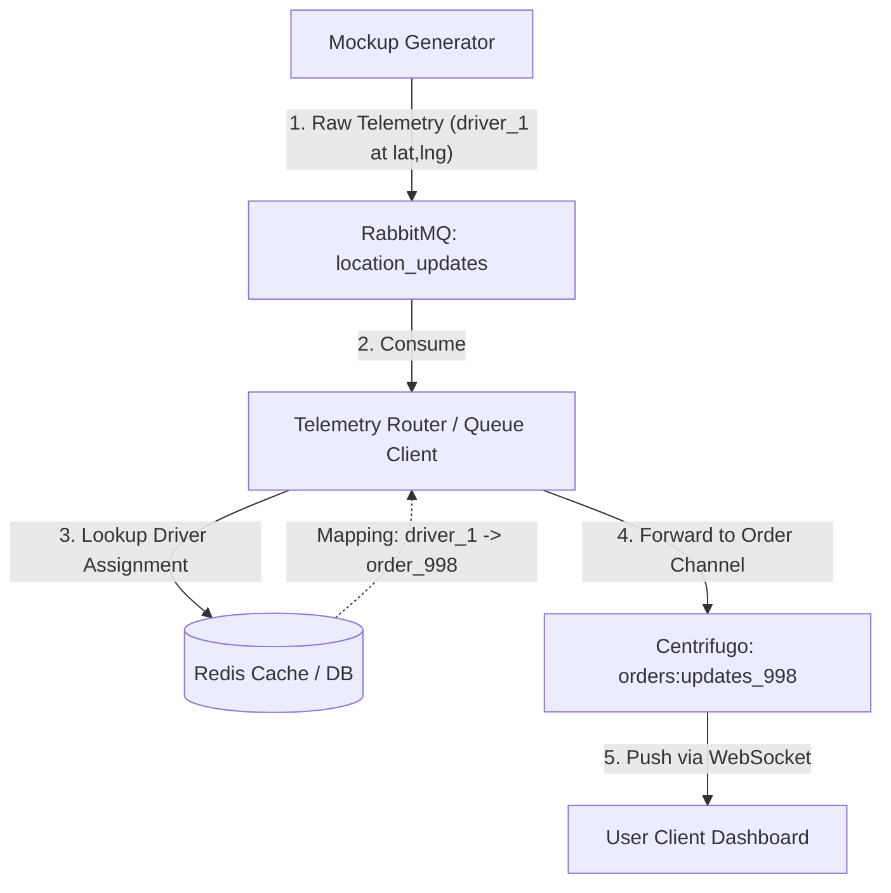
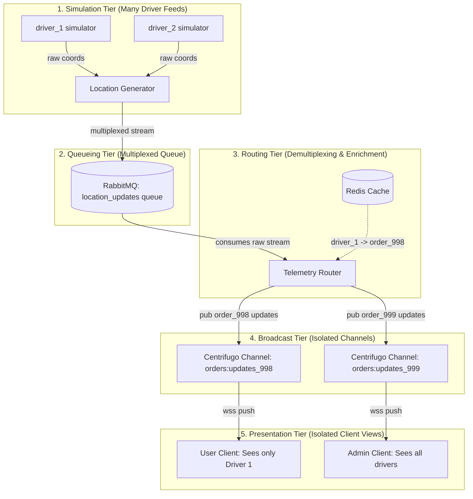
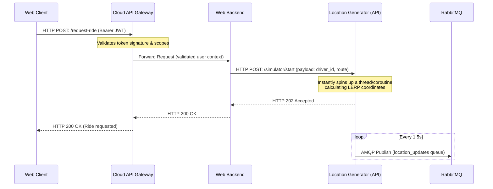
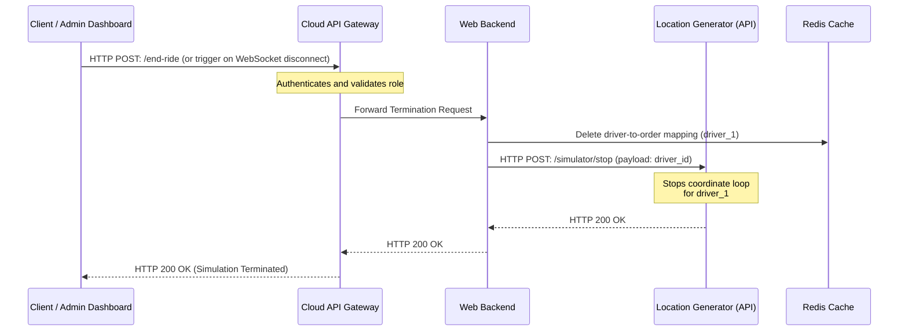
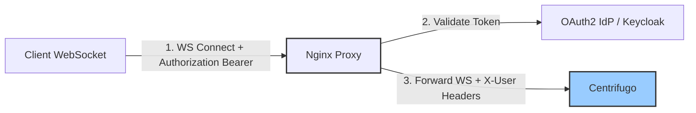
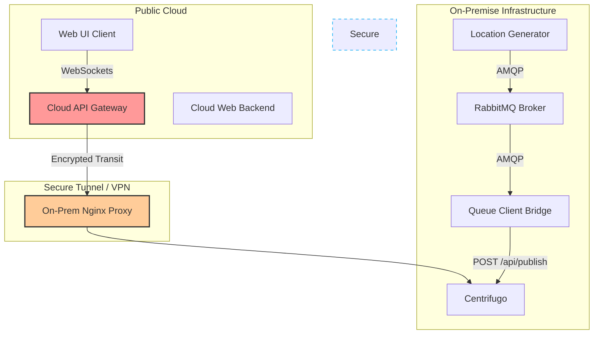
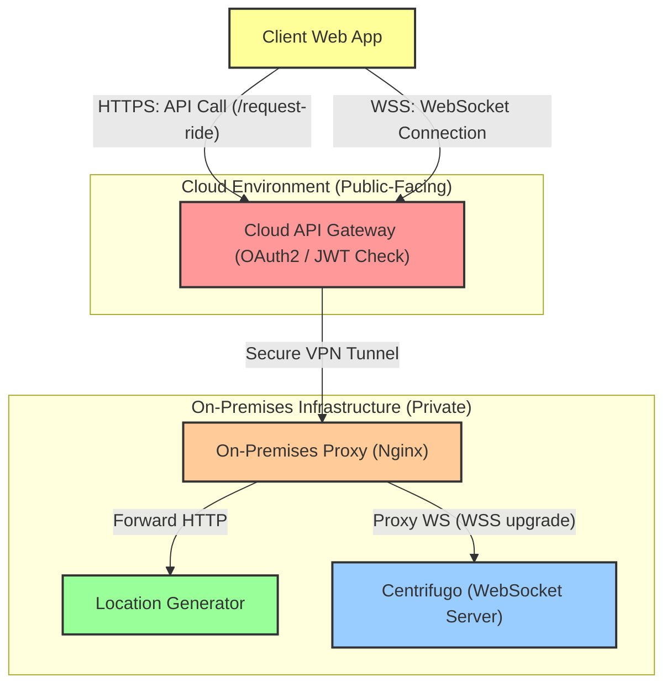

# WSSLab Architecture Proposal: Dynamic Telemetry & Security

This document outlines the proposed design patterns, components, and security architectures for migrating the WSSLab tracking system into a multi-user, dynamic simulation platform with a hybrid cloud/on-premise deployment.

---

## 1. User Request Driver & Subscription Strategy

**Requirement**: User logs in, requests a ride/driver, backend triggers a mock driver allocation, and coordinates are streamed to the client.

### Comparison of Subscription Patterns

#### Option A: User-Specific or Order-Specific Channel (Recommended)
* **How it works**: 
  1. The client establishes a WebSocket connection and subscribes to a unique user channel (e.g., `users:user_123`) or order channel (e.g., `orders:order_998`).
  2. When the backend assigns a driver, it publishes the driver's location payload directly to that user/order channel.
* **Pros**:
  * **Strict Security**: The client only receives events they are authorized to see. They never subscribe directly to a raw driver telemetry stream.
  * **Smooth UX**: The WebSocket connection is established once at page load. The client listens to a single channel to transitions from "Searching" $\rightarrow$ "Assigned" $\rightarrow$ "Live Telemetry".
  * **Decoupling**: The client doesn't need to know the driver ID. The backend routes coordinates dynamically.

#### Option B: Direct Driver-Channel Subscription
* **How it works**:
  1. Client connects via WebSockets.
  2. Client makes an HTTP API request: `POST /request-driver`.
  3. Backend returns a `driver_id` (e.g. `driver_1`).
  4. Client unsubscribes from global channel and subscribes to `drivers:driver_1`.
* **Cons**:
  * **Data Leakage Risk**: Anyone who guesses or sniffs a `driver_id` could subscribe to the driver's location, even if they have no active order with that driver.
  * **Brittle UX**: Subscribing/unsubscribing client-side introduces race conditions and increases WebSocket signaling overhead.

> [!TIP]
### 1.1. Telemetry Routing & Dispatch Mapping (The "Dispatcher")

Since the **Mockup Generator** has no knowledge of users, orders, or CRM systems (and only broadcasts raw driver telemetry), a **Telemetry Router/Dispatcher** component is required to act as the intelligence layer.



#### How the Routing Works:
1. **Dynamic Mapping**: When a user requests a ride, the **Web Backend** selects an available driver (e.g., `driver_1`) and creates an order record (e.g., `order_998`). It saves this active mapping (`driver_1` $\rightarrow$ `order_998`) in a fast key-value store (like **Redis**).
2. **Telemetry Consumption**: The **Telemetry Router** (which can be a module in the Web Backend or an updated `queue-client`) consumes the raw driver locations from RabbitMQ.
3. **Lookup and Forward**:
   * For every coordinate packet received for a `driver_id`, the Router queries the Redis cache.
   * **If mapped to an active order**: The Router wraps the telemetry in an order-update payload and publishes it via Centrifugo to the order-specific channel (e.g., `orders:updates_998`).
   * **If idle**: The coordinates are either discarded or routed only to an admin monitoring channel, saving client-side bandwidth.

### 1.2. Telemetry Multiplexing & Visibility Across Tiers

This section illustrates how coordinates are aggregated (multiplexed) and separated (demultiplexed) as they flow through different tiers, along with what information is visible to each component.



#### Information Visibility Table by Tier

| Tier / Component | Input Streams | Output Channels | Data Visible at this Tier | Security Context |
| :--- | :--- | :--- | :--- | :--- |
| **1. Simulation** (Mockup Generator) | Mathematical formulas | RabbitMQ AMQP | Raw coordinates (`lat`, `lng`), speed, `driver_id`. | No user/order context. Isolated from CRM. |
| **2. Broker** (RabbitMQ) | AMQP writes from Generator | AMQP reads to Router | Raw coordinates, speed, `driver_id` (fully multiplexed). | Blind buffer. No business logic. |
| **3. Dispatcher** (Telemetry Router) | Raw RabbitMQ stream | Centrifugo HTTP Publish | Enriched payload (`order_id`, `user_id`, `driver_id`, `lat`, `lng`). | Complete system visibility (maps drivers to orders/users via Redis). |
| **4. Broadcast** (Centrifugo) | HTTP Publish from Router | WebSocket channels (`orders:*`, `admin:*`) | Raw byte payload (blind forwarding). | Validates client subscription permission per channel string. |
| **5. Presentation** (User Browser) | WSS order channel | HTML5 Canvas Map | Isolated telemetry for the assigned driver only. | Zero knowledge of other drivers/users. |
| **6. Presentation** (Admin Browser) | WSS admin channel | HTML5 Canvas Map | All drivers, orders, and statuses multiplexed together. | Full visibility across the fleet. |

---

## 2. Telemetry Generator Trigger & Lifecycle Management

**Requirement**: How to trigger the coordinate generator when a new driver simulation is requested, and how to cleanly terminate the feed when a ride or order is completed.

### 2.1. Simulator Start Flow (via API Gateway)

Every request from the Web Client to control the simulator must go through the **Cloud API Gateway** to enforce OAuth2 security, rate limits, and client permissions before invoking backend logic.



### 2.2. Simulator Stop & Cleanup Flow (Termination)

To prevent orphaned simulation loops and conserve network/CPU resources, the system must trigger a cleanup when an order or client session becomes inactive.



#### Key Termination Triggers:
1. **User/Admin Action**: The user completes or cancels the ride, or an Admin manually terminates it via the Admin Dashboard.
2. **WebSocket Disconnect Timeout**: If the client's WebSocket connection drops, the **Web Backend** starts a countdown (e.g., 2 minutes). If the client does not reconnect, the backend automatically calls the `/simulator/stop` API to clean up.
3. **Admin Monitoring Dashboard**: The Admin Dashboard queries active subscriptions in Centrifugo and matches them against database records to identify orphaned simulations, providing a "Force Stop" button.

### Options for Generator Coordination

1. **File-based Polling (Shared Volume)**:
   * The backend writes a file (`active_simulations.json`) containing the active driver list. The generator runs a watcher script (e.g., using `watchdog` or polling) to read the file.
   * **Verdict**: Not recommended. It introduces file-locking issues, disk I/O bottlenecks, and does not scale in cloud/on-prem environments where shared volumes are difficult to manage.
2. **API-based Push (HTTP/gRPC) (Recommended)**:
   * The generator runs a lightweight Python web framework (e.g., **FastAPI** or **Flask**) exposing endpoints like `POST /simulator/start` and `POST /simulator/stop`.
   * **Verdict**: Highly recommended. This provides instant triggers, supports payload validation (like target destinations and driver speeds), and is easy to load-balance.

---

## 3. Admin Dashboard & Map controls

**Requirement**: Admin dashboard showing all active drivers on a single map, with filtering and centering features.

### Implementation Checklist

* [ ] **Dashboard Subscriptions**: When logged in as an admin, the dashboard subscribes to the global `locations:updates` channel to receive broadcasts for all drivers.
* [ ] **Sidebar Filter Panel**:
  * Implement text filtering (e.g., search by Driver Name, ID, or Vehicle Type).
  * Filter indicators to group drivers by status (`active` vs `idle`).
* [ ] **Map Viewport Controls**:
  * **Centering/Focus**: Implement a click listener on the sidebar cards that resets the canvas viewport bounds (`MAP_BOUNDS`) to focus on the selected driver's coordinates.
  * **Zooming**: Add standard zoom slide bars or mouse-wheel listeners to expand/contract the rendered canvas grid coordinates dynamically.

---

## 4. Nginx Gateway Validation vs. Centrifugo JWT

**Requirement**: Nginx validates OAuth2 tokens via a lightweight Identity Provider (IdP). Does this conflict with Centrifugo's token validation?

### Recommended Architecture: Trusted Header Auth

Validating JWTs twice (once at Nginx, once at Centrifugo) is redundant and adds latency. The industry-standard approach is to offload authentication to the Nginx gateway and configure Centrifugo to trust Nginx.



1. **Nginx OAuth2 Validation**:
   * Nginx uses a module (e.g., `oauth2-proxy` or `ngx_http_auth_request_module`) to intercept the connection, validate the Bearer JWT token against the IdP, and extract user claims (e.g., `sub` user ID).
2. **Nginx Header Forwarding**:
   * After validation, Nginx proxy-passes the request to Centrifugo and injects secure headers containing the validated identity, e.g.:
     ```nginx
     proxy_set_header X-User $auth_user;
     ```
3. **Centrifugo Trust Configuration**:
   * Configure Centrifugo to run in **Trusted Header Mode** (using options `allowed_origins` and `auth_header`). Centrifugo bypasses JWT checks and trusts the `X-User` header inserted by Nginx since it is running inside the secure network perimeter.

---

## 5. Hybrid Cloud/On-Premises Security Recommendations

**Scenario**: Webapp and Web Backend are deployed in the Cloud (with API Gateway + OAuth2). Centrifugo, RabbitMQ, Queue Client, and Mock Location Generator run On-Premise.



### Security Checklist & Strategies

### 1. Ingress Protection (No Direct Inbound Ports)
* **Risk**: Exposing RabbitMQ or Centrifugo directly to the internet is a major security vulnerability.
* **Strategy**: Use an **outbound reverse tunnel** (e.g., Cloudflare Tunnel, AWS Site-to-Site VPN, or WireGuard). This allows the on-premises Nginx Proxy to establish a secure outbound tunnel to the cloud gateway. You do not need to open any inbound ports on the on-premises firewall.

### 2. Microservice Isolation (On-Premises Network)
* **Centrifugo API Access**: Protect Centrifugo’s HTTP publish endpoint (`/api/publish`) so it is only reachable by the on-premise `queue-client` and cloud backend via VPN.
* **RabbitMQ Firewalling**: RabbitMQ should only bind to local interfaces or the internal docker network, never listening on public host ports.

### 3. End-to-End Encryption (E2EE) for Telemetry
* **Strategy**: If vehicle coordinate data is sensitive:
  1. The `mockup-generator` encrypts the coordinate payload using a shared symmetric key before publishing to RabbitMQ.
  2. The payload remains encrypted through RabbitMQ and Centrifugo.
  3. The authorized Web Client decrypts the payload client-side in the browser using the session key obtained during login.
  * This guarantees that even if the message broker (RabbitMQ) or bridge are compromised, the raw tracking data remains secure.

### 4. Simulating this in a Podman Lab Environment

You can simulate the separation of Cloud and On-Premise networks locally on a single machine using Podman networks and firewall options:

1. **Create Isolated Podman Networks**:
   ```bash
   # Network representing the Public Cloud
   podman network create cloud-net
   
   # Network representing the Private On-Premise facility
   podman network create --internal onprem-net
   ```
   *Note: The `--internal` flag blocks all outbound/inbound internet access for containers connected to `onprem-net`, isolating them completely.*

2. **Connect Components**:
   * **Cloud Components**: Connect your `cloud-nginx` (acting as the Cloud API Gateway) and `web-backend` to `cloud-net`.
   * **On-Premise Components**: Connect `centrifugo`, `rabbitmq`, `queue-client`, and the `mockup-generator` to `onprem-net`.
   * **The Bridge/Tunnel**: Add `cloud-nginx` (API Gateway) to **both** `cloud-net` and `onprem-net`. This simulates the secure tunnel/VPN. The only way the cloud components or external clients can reach the on-premise components is by routing through the Nginx gateway.

3. **Verify Isolation**:
   * Attempting to query `centrifugo` directly from the host machine or from a container on `cloud-net` (except through Nginx) will fail, proving the firewall and network boundaries are secure.

### 5. Routing Breakdown: HTTPS vs. WSS

Both HTTPS (REST APIs) and WSS (WebSocket connection) requests **must** flow through the API Gateway. Bypassing the gateway for either protocol leaves the internal components exposed to unauthorized queries, denial of service (DoS), and data harvesting.

#### Protocol Routing Pathways:



* **HTTPS APIs (Control Flow)**:
  * Used for requesting rides (`/request-ride`), stopping simulations (`/end-ride`), or loading historical reports.
  * **Path**: `Client` $\rightarrow$ `Cloud API Gateway` $\rightarrow$ `Web Backend` $\rightarrow$ `On-Prem Location Generator`.
* **WSS WebSockets (Data Flow)**:
  * Used for receiving real-time coordinates.
  * **Path**: `Client` $\rightarrow$ `Cloud API Gateway` $\rightarrow$ `On-Prem Centrifugo` (broadcasts raw payloads received from the on-prem `queue-client`).

---

### 4.1. Basic Network Isolation vs. True VPN Emulation in the Lab

When simulating this environment in your local lab using Podman:
* **Why Basic Isolation is Usually Enough**: 
  * The dual-network setup (`cloud-net` + `onprem-net` with Nginx as a gateway bridge) is **95% sufficient** for development and testing. 
  * It forces your applications to handle host header resolution, proxy routing, and dynamic IPs, which matches the routing logic of a real production deployment.
* **When to emulate a True VPN**:
  * If you need to test network overhead, MTU limits, network drops/reconnections, or encryption latency.
  * **How to simulate**: You can run two **WireGuard** containers (one on `cloud-net` and one on `onprem-net`) that establish a secure handshake. You then configure the cloud and on-premise components to route their traffic exclusively through the virtual interface (`wg0`) of these containers.

---

## 6. The Corporate Network Reality: Inbound vs. Outbound Policies

You are **completely correct**. In enterprise corporate networks, requesting new firewall rules—especially **inbound** policies (opening ports to the outside world)—is notoriously difficult and often flatly rejected by IT security officers.

### The Inbound vs. Outbound Difference

* **Inbound Policy (Highly Restricted)**: 
  * *Request*: "Open port 443 on-premises to public IP `1.2.3.4` in the cloud."
  * *Security view*: Fails risk assessments. It opens an entry vector directly into the corporate LAN, making internal systems vulnerable to scanning, zero-day exploits, and lateral movement.
* **Outbound Policy (Permissible / Standard)**:
  * *Request*: "Allow internal server `10.0.1.5` to connect outbound to Keycloak/Cloudflare/AWS API on port 443."
  * *Security view*: Standard behavior. Most firewalls allow outbound HTTPS connections by default, or require a simple, standard domain-whitelisting rule.

### The Solution: Outbound Reverse Tunnels

To bridge cloud-to-on-premises without requesting restricted inbound policies, modern hybrid architectures use **Outbound Reverse Tunnels** (e.g., Cloudflare Tunnel (`cloudflared`), AWS Systems Manager Session Manager, or proprietary gRPC connectors):

```text
       [ PUBLIC CLOUD ]                         [ ON-PREMISES (Private) ]
┌─────────────────────────────┐             ┌────────────────────────────────┐
│  Cloud API Gateway / Proxy  │             │   Internal App (Centrifugo)    │
└──────────────┬──────────────┘             └────────────────┬───────────────┘
               ▲                                             ▲
               │ (Reuses tunnel for                          │ (Local proxy)
               │  inbound proxying)                          │
               │                                             ▼
       ┌───────┴──────────────┐   Outbound HTTP2/gRPC   ┌────┴───────────────┐
       │   Tunnel Server      │◄────────────────────────┤ On-Prem Tunnel Agt │
       │ (e.g. Cloudflare Edge)  (Establishes connection│ (e.g. cloudflared) │
       └──────────────────────┘   on port 443 / HTTPS)  └────────────────────┘
                                                     (Requires ZERO inbound
                                                      firewall ports open!)
```

#### How it works:
1. An on-premises **Tunnel Agent** (a lightweight daemon) starts up and makes an **outbound** secure HTTPS/TCP connection (port 443) to a designated Cloud Gateway edge server.
2. This outbound connection is kept active as a persistent stateful tunnel (using multiplexed HTTP2 or gRPC).
3. When Nginx in the cloud wants to forward a request (HTTP API or WS handshake) to the on-premise Centrifugo, the Cloud Gateway passes the request **backwards** through the existing outbound TCP socket.
4. The firewall sees this as standard outbound responses, allowing the bidirectional data flow while keeping the on-premise network completely closed to external ingress probes.
